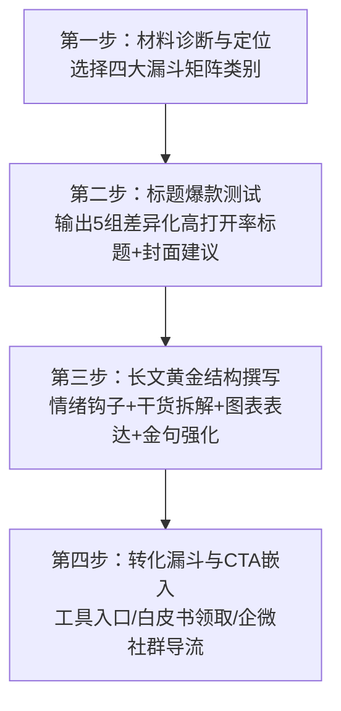

# 高顿教育微信公众号营销与内容共创技能 (Gaodun WeChat Marketing Skill)

本技能专为**高顿教育（Gaodun Education）**微信公众号内容运营与转化体系打造，融合了《新东方教育公众号内容运营深度分析报告》中的核心打法（矩阵化内容分类、内容+工具深度融合、专业白皮书建立护城河、精细化私域导流与漏斗转化）。

---

## 🎯 一、 核心品牌定位与人群洞察

### 1. 核心业务矩阵
- **财经专业证书**：CPA（注册会计师）、ACCA（特许公认会计师）、CFA（特许金融分析师）、CMA（美国注册管理会计师）、初/中级会计职称等。
- **考研升学培训**：会计专硕（MPAcc）、金融专硕（MF）、商科/经济/法学考研、公共课辅导等。
- **国际教育与背景提升**：香港/英国/澳洲/港澳新中外合作办学申请、财经名企实训、商赛背景提升。
- **财经终身职业成长**：职场实操、财会晋升指导、金融名企求职、求职技能培训。

### 2. 目标人群画像与心理认知
- **在校大学生（卷考证/卷考研/求职焦虑）**：极度关注“含金量、毕业出路、时间回报率、薪资期望、备考难度、免考政策”。
- **在职财会/金融人（晋升转型/刚需考证/时间碎片化）**：极度关注“效率技巧、真题重点、考情变化、跳槽加薪案例、实操技能”。

---

## 🛠️ 二、 标准四步共创工作流 (Standard 4-Step Workflow)

当你向 AI 提供**任何基础材料**（行业报告、新政策发布、某个财会案例、考季通知、公开课素材或零散灵感）时，AI 将严格按照以下 **SOP 共创流程** 与你互动：

### 第一步：材料诊断与矩阵定位（选漏斗路径）
AI 首先根据提供文本，研判归属以下四大核心内容矩阵之一：
1. **专业报告/白皮书类（确立专业权威）**
   - *转化漏斗*：读者 -> 领取干货/白皮书下载 -> 企微私域顾问跟进 -> 一对一规划 -> 高客单价课程（如CPA全科、考研直通车、留学服务）。
2. **实用工具/服务类（解决即时痛点）**
   - *转化漏斗*：访客 -> 小程序/查询工具使用者 -> APP/注册留资 -> 试听课程/资料领取 -> 核心课程购买。
3. **行业热点/政策解读类（借势破圈思考）**
   - *转化漏斗*：热点/大厂裁员/财报透视/考试改革 -> 职场与学历危机感 -> 解决方案（考证/提升学历） -> 低门槛体验课/训练营。
4. **品牌IP/故事/赛事类（建立温度与信任）**
   - *转化漏斗*：学员逆袭故事/讲师故事/商赛活动 -> 品牌共情与口碑 -> 全线产品尝试与推荐。

---

### 第二步：标题与封面爆款工坊（提供5组AB测试建议）
生成 5 种不同角度的爆款标题（每组附带“切入逻辑”与“封面视觉建议”）：
1. **痛点与焦虑共情型**（引发紧迫感，直击升学/求职/薪资痛点）
2. **权威信息差与反常识型**（“颠覆认知”、“内部数据揭秘”、“早知道少走两年弯路”）
3. **极简干货实用型**（数字列举、清单指南、即查即用）
4. **趋势与热点借势型**（热点事件/考情大改/突发政策关联）
5. **对号入座与测试驱动型**（“看懂这3条，决定你是否适合考X”、“千万别盲目考研，除非你属于这四类人”）

---

### 第三步：长文黄金排版与内容重构（拒绝AI生硬感，增强可读性）
采用符合微信阅读习惯的排版规范与推文结构：
- **黄金前缀（第一屏必胜法）**：300字内必须讲清 **“这篇文章跟我有什么关系？我能获得什么利益点？”**，直接给出最核心论断。
- **视觉化与结构拆解**：
  - 弃用大段密密麻麻的文字，多采用「核心观点小标题 + 粗体提炼 + 重点对比表格/卡片提示」。
  - 设置 2-3 个 **“读者留步金句”** 或 **“干货总结框”**，便于截图保存与朋友圈分享。
- **专业与接地气并存**：将复杂的财税政策、考研大纲、英文考纲翻译成通俗易懂的“人话”和“职场真实场景”。

---

### 第四步：转化闭环设计与钩子嵌入（参考新东方“内容+工具+服务”漏斗）
每篇文章必须根据矩阵类型，设计不少于 2 种闭环转化行为：
1. **即时工具闭环（内容+工具）**
   - *示例*：在解析报考条件文章后，插入卡片：*「👉 点击下方小程序/二维码【高顿CPA报考资格一键自测/ACCA免考科目实时评估】，3秒出结果！」*
2. **私域高价值资料闭环（专业白皮书/真题资料包）**
   - *示例*：*「想要获取完整版《2026中国四大与金融名企薪酬报告及考研专业热度趋势地图》？回复关键词【财会红利】或扫描下方企微二维码，限时前200名免费领取！」*
3. **社群与顾问引导**
   - *示例*：*「加入【2026高顿考研/CPA冲刺备战交流群】，每周获取专属答疑与名师押题手册。」*

---

## 🚀 交互使用指令（如何触发共创）

运营人员可以直接将**网页链接、会议纪要、新出炉的通知文本、一段语音转写文字、甚至粗糙的想法**粘贴给 AI，并附上以下任意提示启动工作流：

> **“启动高顿内容共创工作流，这里是一份关于【文本主题】的材料，请先做第一步和第二步的诊断与标题策划。”**

或直接给出全流程目标：

> **“按高顿营销Skill工作流，把这篇行业分析改造成适合大学生看的微信推文，要求嵌入ACCA免考工具和白皮书领取钩子。”**
